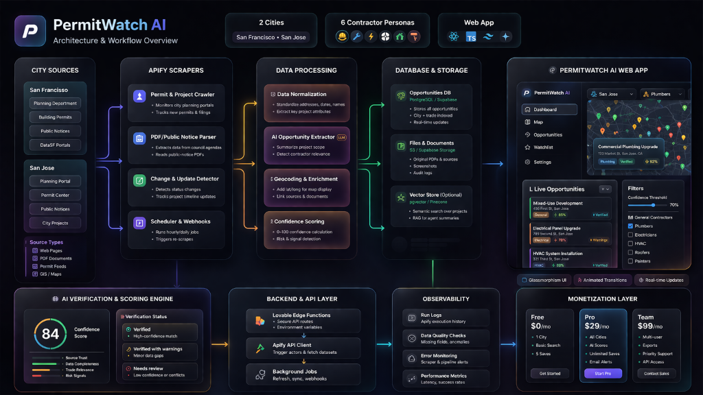

# PermitWatch AI

**AI-powered construction opportunity discovery for contractors.**

PermitWatch AI monitors city planning portals, building departments, and public-notice PDFs — then extracts project details, maps locations, and scores each opportunity with an AI confidence and verification layer.

## Architecture



## Supported Cities

| City | Sources |
|------|---------|
| **San Francisco** | SF DBI Online Permit Portal, SF Planning Dept Public Notices |
| **San Jose** | San Jose Permit Center |

## Contractor Personas

- 🔨 General Contractors
- 🔧 Plumbers
- ⚡ Electricians
- 🌬️ HVAC Contractors
- 🏠 Roofers
- 🎨 Painters

## Features

- **Real-time permit monitoring** — Automated scraping via Apify with mock fallback
- **AI verification & scoring** — Confidence scores (0–100) with evidence-based verification statuses
- **Interactive map view** — Dark CARTO tiles with clustered opportunity markers
- **Smart filtering** — By city, contractor type, confidence threshold, permit type, project stage
- **Watchlist** — Save and track high-priority opportunities
- **Glassmorphism UI** — Premium dark theme with framer-motion animations

## Tech Stack

| Layer | Technology |
|-------|-----------|
| Frontend | React 19, Vite, Vanilla CSS |
| Animations | Framer Motion |
| Maps | Leaflet + React-Leaflet (CARTO dark tiles) |
| Icons | Lucide React |
| Scraping | Apify Cloud (configurable) |
| AI Analysis | OpenAI-compatible API (configurable) |
| State | React Context + useReducer |

## Getting Started

```bash
# Install dependencies
npm install

# Start dev server (mock data mode)
npm run dev

# Production build
npm run build
```

## Environment Variables

Copy `.env.example` to `.env` and configure:

```env
# Backend API (optional — bypasses client-side logic)
VITE_API_BASE_URL=

# Apify scraping (optional — uses mock data if empty)
VITE_APIFY_TOKEN=

# AI verification (optional — uses base scoring if empty)
VITE_AI_ENDPOINT=
VITE_AI_API_KEY=
VITE_AI_MODEL=gpt-4o
```

The app runs in **demo mode** by default with mock data. Set environment variables to enable real scraping and AI analysis.

## Project Structure

```
src/
├── services/
│   ├── apiClient.js           # Central HTTP client
│   ├── opportunityService.js  # Opportunity CRUD + refresh
│   ├── watchlistService.js    # Save/remove watchlist items
│   ├── authService.js         # Login/signup/logout
│   ├── apifyService.js        # Apify actor management
│   ├── scraperConfigs.js      # Per-city actor configs
│   ├── dataTransformer.js     # Raw data → frontend schema
│   ├── scraperPipeline.js     # End-to-end orchestrator
│   ├── analysisService.js     # AI verification via LLM
│   ├── agentPrompt.js         # AI agent system prompt
│   └── api.js                 # Re-export hub
├── pages/                     # Landing, Login, Dashboard, Watchlist, Settings
├── components/                # Map, Cards, Detail Panel, Sidebar, Toast
├── context/                   # Global state (AppContext)
├── data/                      # Mock opportunities
└── styles/                    # Component CSS modules
```

## Data Pipeline

```
City Sources → Apify Scrapers → Data Transformer → AI Analysis → Dashboard
     ↓              ↓                ↓                ↓            ↓
  SF DBI        runActor()     transformDataset()  analyzeOpp()  Sorted feed
  SF Planning   waitForRun()   deduplication       confidence    + map markers
  SJ Permits    getDataset()   field normalization scoring       + KPI cards
```

## Verification Statuses

| Status | Meaning |
|--------|---------|
| ✅ **Verified** | Source confirmed, project moving forward |
| ⚠️ **Verified with Warnings** | Confirmed but has risk factors |
| 🔍 **Needs Review** | Not yet confirmed, early stage |

## License

MIT
